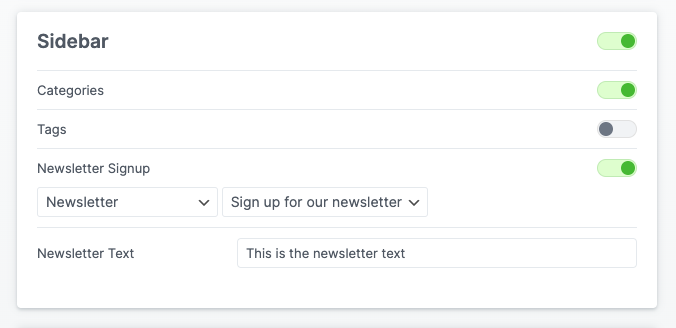
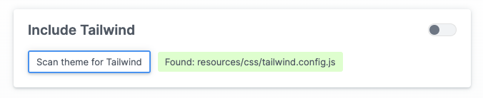

# LL Blog Plugin

## CSS Template
The blog template has minimal default styles applied for positioning. This template should provide all of the classes necessary to style the archive and single post pages. The nesting in this template will ensure specificity over the default styles.

```
/* Archive Page */

.ll-archive-wrapper {

  .ll-archive-subtitle {
    
  }
  .ll-archive-title {
   
  }
  .ll-archive-load-more-button {
    
  }
  .ll-archive-no-more-posts {
   
  }

}

/* Single Page */

.ll-single-wrapper {

  .ll-back-to-archive-link {

  }
  .ll-post-header-small-text {

  }
  .ll-post-header-title {

  }
  .ll-post-header-category {

  }
  .ll-post-header-details-divider {

  }
  .ll-post-header-date {

  }
  .ll-post-footer-header {
   
  }
  .ll-post-footer {

  }
  .ll-post-footer-block {
   
  }
  .ll-single-tag-list {

  }
  .ll-single-post-tag {
   
  }

}

/* Sidebar */

.ll-blog-sidebar {
 
  .ll-sidebar-header {
    
  }
  .ll-sidebar-category-list {

  }
  .ll-sidebar-category-item {
    
  }
  .ll-sidebar-tag-list {
    
  }
  .ll-sidebar-tag {
    
  }
  .ll-sidebar-newsletter-signup {

  }
  .ll-sidebar-newsletter-label {
    
  }
  .ll-sidebar-newsletter-input-wrapper {
   
  }
  .ll-sidebar-newsletter-email-input {
    
  }
  .ll-sidebar-newsletter-submit {
    
  }
}


/* Cards */

.ll-blog-card {

  .ll-card-corner-tag {
   
  }
  .ll-card-post-title {
  
  }
  .ll-card-post-date {
  
  }
  .ll-card-post-excerpt {
   
  }
  .ll-card-post-link {
    
  }
}
```

## Hooks
Need to jam some content underneath the archive or single page?
Use these hooks: 

### Archive
```
add_action('ll_blog_archive_after', 'thing_to_do_at_bottom_of_archive');
```
content will be wrapped in a div with the class `.ll-blog-archive-after`
### Single
```
add_action('ll_blog_single_after', 'thing_to_do_at_bottom_of_single');
```
content will be wrapped in a div with the class `.ll-blog-single-after`
### single but just right after content
```
add_action('ll_blog_single_after_content', 'thing_to_do_at_bottom_of_single');
```

## Newsletter Form
For a better developer experience and to avoid conflicts with other forms that might be on the page, the Blog Plugin uses Gravity Forms headlessly. Just select the form and field in the blog admin page to wire it up.



## Tailwind
If installing on a site that doesn't have tailwind, we can serve it from the plugin. This option can be seleted in the Developer tab of the blog admin page. If you are unsure if the site has tailwind or not, there's a button that will scan the theme for a `tailwind.config.js` file.

